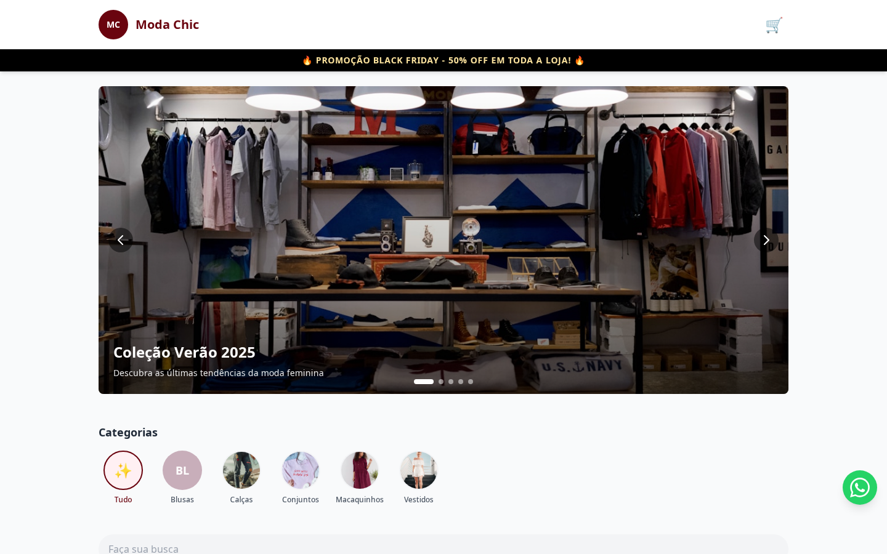
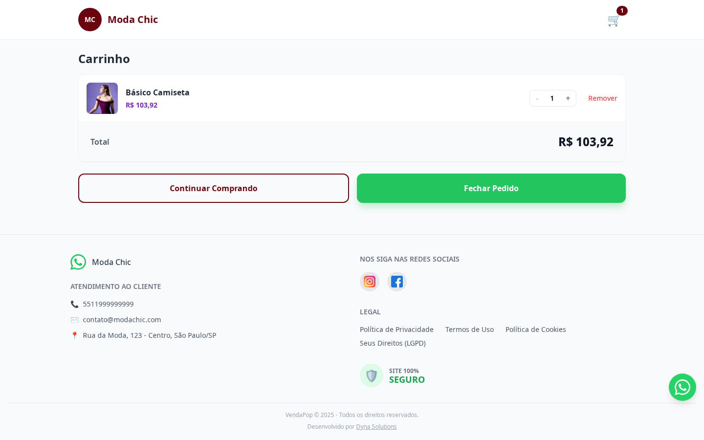
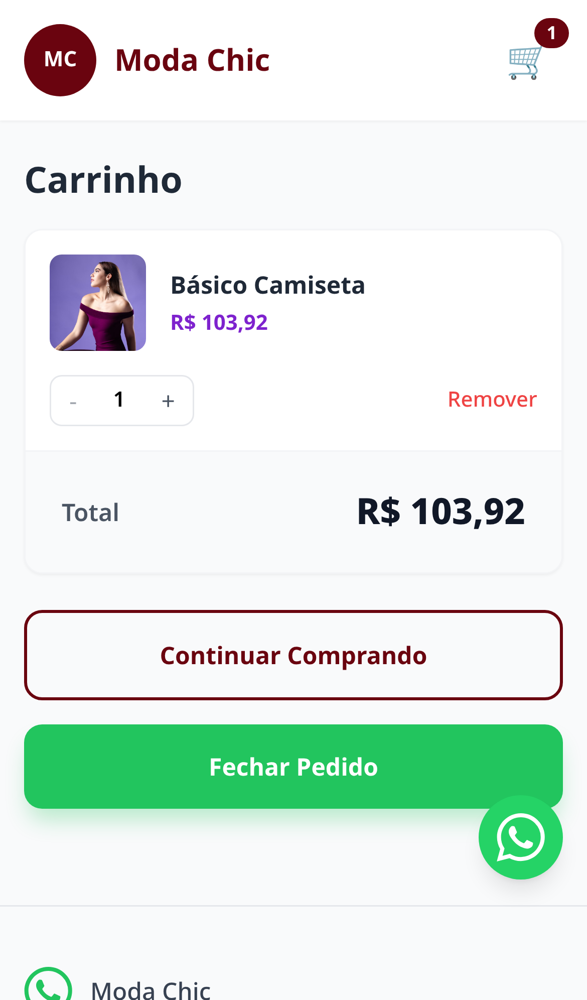
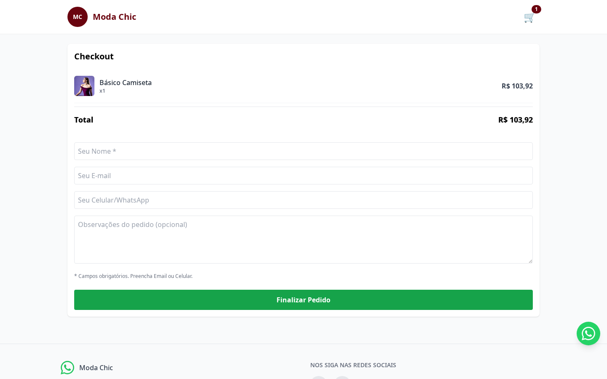
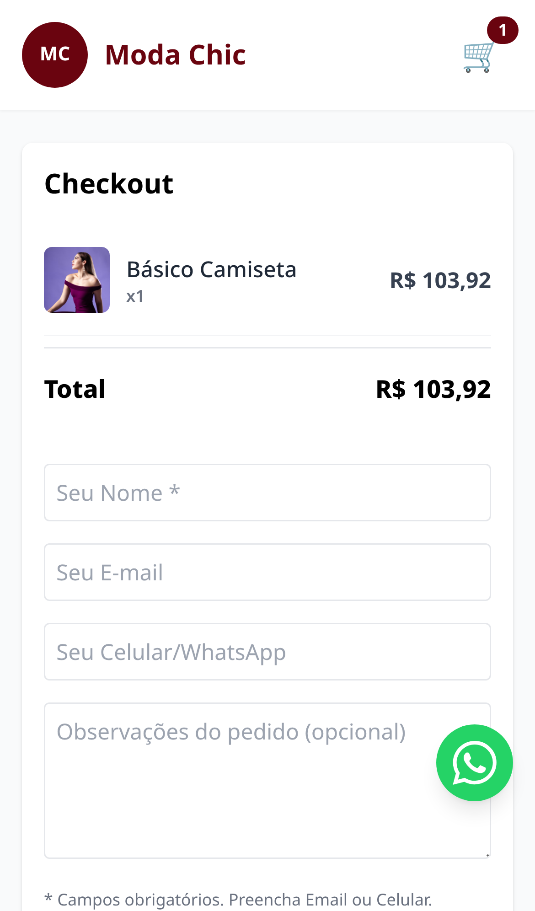
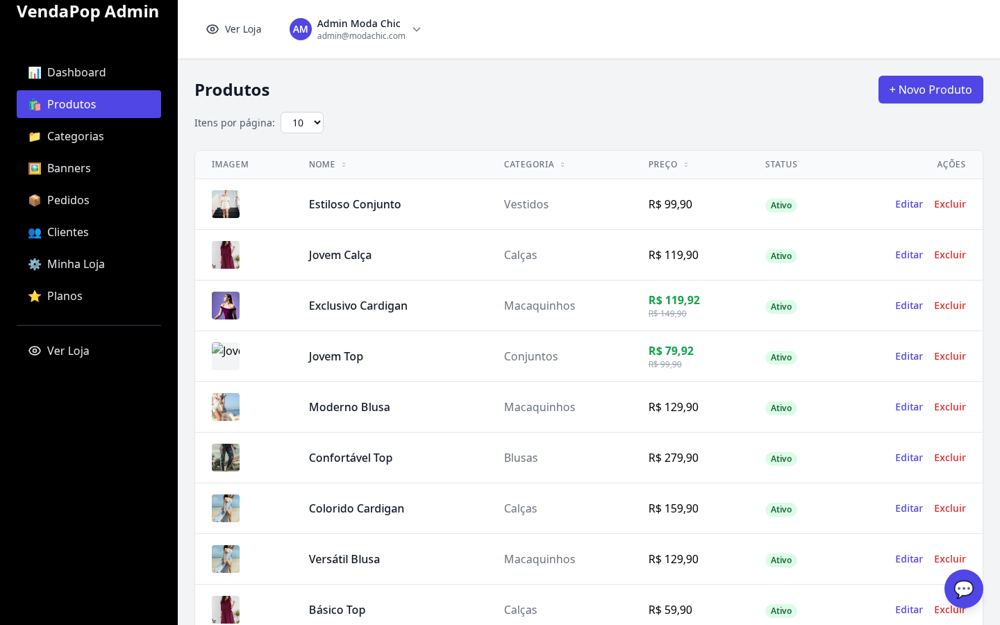
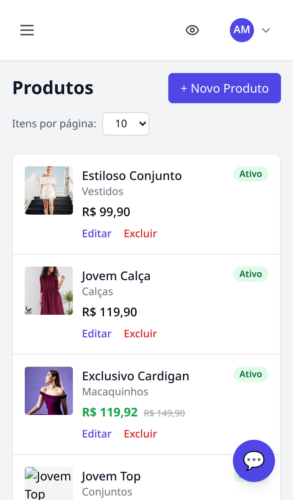

# VendaPop 🛍️

**Plataforma de Catálogo Online Multi-loja com Finalização via WhatsApp**

[](https://laravel.com)
[](https://reactjs.org)
[](https://www.typescriptlang.org)
[](https://www.docker.com)
[](https://www.mysql.com)

🔗 **Demo ao vivo:** [vendapop.com.br](https://vendapop.com.br) (loja `/modachic`, dados de seed) · [Histórico de versões](RELEASE_NOTES.md)

## 📋 Sobre o Projeto

VendaPop é uma plataforma SaaS multi-tenant que permite a qualquer lojista ter seu próprio catálogo online com fluxo completo de compra, finalizando pedidos diretamente via WhatsApp. Moda, eletrônicos, imobiliária, encomendas — qualquer negócio que venda pelo Instagram e WhatsApp.

### ✨ Funcionalidades Principais

- **🏪 Multi-loja**: Cada tenant tem sua própria loja isolada
- **📱 PWA**: Funciona como app mobile nativo
- **🛒 Carrinho de Compras**: Experiência completa de e-commerce
- **💬 WhatsApp Integration**: Finalização de pedidos via WhatsApp
- **📊 Painel Admin**: Gestão completa de produtos, categorias e pedidos
- **🎨 Customização**: Cores e identidade visual por loja
- **🔔 Notificações**: Sistema de notificações para administradores (Email, Push e WhatsApp)

## 🚀 Tecnologias Utilizadas

### Backend
- **Laravel 12** - Framework PHP para API REST
- **MySQL 8.0** - Banco de dados relacional
- **Laravel Sanctum** - Autenticação API

### Frontend
- **React 18** - Biblioteca JavaScript para interface
- **TypeScript** - Superset JavaScript com tipagem
- **Vite** - Build tool e dev server
- **Tailwind CSS** - Framework CSS utility-first
- **React Router** - Roteamento SPA

### Infraestrutura
- **Docker & Docker Compose** - Containerização
- **Nginx** - Servidor web (produção)

## 🔌 Integrações

| Integração | Uso |
|---|---|
| Mercado Pago | Checkout e cobrança de assinatura dos planos |
| Google OAuth | Login social do lojista |
| ReCAPTCHA | Proteção anti-bot em formulários públicos |
| WhatsApp | Finalização de pedido e notificação de admin |
| Web Push (VAPID) | Notificações push pro admin |
| Google Analytics 4 | Métricas de loja |

## 🏗️ Arquitetura: Factory + Adapter no gateway de pagamento

O pagamento é abstraído atrás de uma interface de domínio (`App\Domain\Payment\PaymentGateway`), implementada por um Adapter por gateway (`MercadoPagoAdapter`). A `PaymentGatewayFactory` escolhe a implementação certa em runtime via config (`services.payment.gateway`).

```
App\Domain\Payment\PaymentGateway        (interface)
        ↑ implements
App\Infrastructure\Payment\Adapters\MercadoPagoAdapter
        ↑ instanciado por
App\Infrastructure\Payment\PaymentGatewayFactory
```

Isso deixa plugar um gateway novo (Stripe, PagSeguro etc.) sem tocar em regra de negócio — só criar o Adapter e registrar na Factory.

## 🛠️ Instalação e Execução

### Pré-requisitos

- Docker e Docker Compose instalados
- Git

### Passos para Instalação

1. **Clone o repositório**
   ```bash
   git clone <repository-url>
   cd vendapop
   ```

2. **Suba os containers**
   ```bash
   docker compose up --build -d
   ```

3. **Instale dependências e configure o banco**
   ```bash
   docker compose exec backend composer install
   docker compose exec backend php artisan migrate --seed
   ```

4. **Configure notificações (opcional)**
   ```bash
   # Gere chaves VAPID para push notifications
   docker compose exec backend php scripts/generate-vapid-keys.php
   ```
   Copie as chaves geradas e adicione ao arquivo `backend/.env`:
   ```env
   VAPID_PUBLIC_KEY=sua_chave_publica
   VAPID_PRIVATE_KEY=sua_chave_privada
   VAPID_SUBJECT=mailto:admin@vendapop.com.br
   ```

5. **Acesse a aplicação**
   - **Loja**: http://localhost:5173/modachic
   - **Admin**: http://localhost:5173/admin/login
   - **API**: http://localhost:8000/api

### Credenciais de Teste

**Admin:**
- Email: `admin@modachic.com`
- Senha: `password`

## 📁 Estrutura do Projeto

```
vendapop/
├── backend/                  # API Laravel
│   ├── app/
│   │   ├── Models/          # Modelos Eloquent
│   │   ├── Http/Controllers/Api/  # Controllers da API
│   │   ├── Services/        # Lógica de negócio (camada de aplicação)
│   │   ├── Domain/          # Interfaces de domínio (ex: PaymentGateway)
│   │   ├── Infrastructure/  # Implementações concretas (Adapters, Factories)
│   │   ├── UseCases/        # Casos de uso isolados por contexto
│   │   ├── Repositories/    # Repositórios (Eloquent + interfaces)
│   │   └── Contracts/       # Interfaces de serviço
│   ├── database/
│   │   ├── migrations/      # Migrations do banco
│   │   └── seeders/         # Seeds para dados iniciais
│   ├── tests/                # Testes Feature + Unit (PHPUnit)
│   └── routes/api.php        # Rotas da API
├── frontend/                 # SPA React
│   ├── src/
│   │   ├── components/      # Componentes reutilizáveis
│   │   ├── pages/           # Páginas da aplicação
│   │   ├── services/        # Serviços de API
│   │   └── layout/          # Layouts e templates
│   ├── e2e/                  # Testes end-to-end (Playwright)
│   ├── public/                # Assets estáticos
│   └── package.json          # Dependências Node.js
├── deploy/                   # Deploy de produção (Docker Compose + Nginx)
│   ├── docker-compose.prod.yml
│   ├── Dockerfile.backend / Dockerfile.frontend
│   ├── deploy.sh              # Script de deploy
│   └── nginx/
├── docker-compose.yaml       # Configuração Docker (desenvolvimento)
├── docs/                     # Documentação técnica
│   ├── especificacao-tecnica.md
│   ├── DEPLOY.md
│   ├── configuracao-mercadopago.md
│   ├── configuracao-google-analytics.md
│   ├── configuracao-integrações.md
│   └── screenshots/           # Prints usados neste README
└── RELEASE_NOTES.md          # Histórico de versões
```

## 🔧 Comandos Úteis

### Desenvolvimento
```bash
# Subir containers
docker compose up -d

# Ver logs
docker compose logs -f

# Acessar container backend
docker compose exec backend bash

# Acessar container frontend
docker compose exec frontend sh
```

### Laravel (Backend)
```bash
# Criar migration
php artisan make:migration create_table_name

# Criar model
php artisan make:model ModelName

# Executar migrations
php artisan migrate

# Popular banco
php artisan db:seed
```

### React (Frontend)
```bash
# Instalar dependências
npm install

# Rodar em modo desenvolvimento
npm run dev

# Build para produção
npm run build
```

## 🗄️ Modelo de Dados

### Principais Entidades

- **Tenants**: Lojas/empresas
- **Users**: Administradores das lojas
- **Categories**: Categorias de produtos
- **Products**: Produtos do catálogo
- **Customers**: Clientes finais
- **Orders**: Pedidos realizados
- **OrderItems**: Itens dos pedidos

### Relacionamentos

```
Tenant (1) ──── (N) User
Tenant (1) ──── (N) Category
Tenant (1) ──── (N) Product
Tenant (1) ──── (N) Customer
Tenant (1) ──── (N) Order
Category (1) ── (N) Product
Customer (1) ── (N) Order
Order (1) ───── (N) OrderItem
Product (1) ─── (N) OrderItem
```

## 🔔 Sistema de Notificações

O VendaPop possui um sistema completo de notificações que alerta os administradores quando um novo pedido é criado.

### Tipos de Notificação

1. **📧 Email**: Enviado automaticamente para o email cadastrado do administrador
2. **🔔 Push Notification**: Notificação no navegador (requer permissão do usuário)
3. **💬 WhatsApp**: Link do WhatsApp com número do pedido, link e nome do cliente

### Configuração

#### 1. Gerar Chaves VAPID (para Push Notifications)

Execute o script dentro do container:

```bash
docker compose exec backend php scripts/generate-vapid-keys.php
```

O script irá:
- Instalar a biblioteca `minishlink/web-push` se necessário
- Gerar as chaves VAPID automaticamente
- Exibir as chaves para adicionar ao `.env`

#### 2. Adicionar Chaves ao .env

Adicione as chaves geradas ao arquivo `backend/.env`:

```env
VAPID_PUBLIC_KEY=sua_chave_publica_aqui
VAPID_PRIVATE_KEY=sua_chave_privada_aqui
VAPID_SUBJECT=mailto:admin@vendapop.com.br
```

**Importante:**
- `VAPID_PUBLIC_KEY`: Chave pública (pode ser compartilhada)
- `VAPID_PRIVATE_KEY`: Chave privada (mantenha em segredo!)
- `VAPID_SUBJECT`: Email de contato (formato: `mailto:email@exemplo.com`)

#### 3. Executar Migration

```bash
docker compose exec backend php artisan migrate
```

### Testando Push Notifications Localmente

Push notifications funcionam em:
- ✅ **localhost** (http://localhost)
- ✅ **127.0.0.1** (http://127.0.0.1)
- ✅ **HTTPS** (produção)

**Passos para testar:**

1. **Acesse o painel admin** em `http://localhost:5173/admin/login`

2. **Permita notificações no navegador**
   - O navegador solicitará permissão automaticamente
   - Clique em "Permitir" quando solicitado

3. **Registre a subscription** (automático)
   - O frontend registra automaticamente a subscription de push
   - Verifique no console do navegador se houve sucesso

4. **Crie um pedido de teste**
   - Acesse a loja: `http://localhost:5173/modachic`
   - Adicione produtos ao carrinho
   - Finalize um pedido

5. **Verifique as notificações**
   - **Email**: Verifique a caixa de entrada (ou MailHog em `http://localhost:8025`)
   - **Push**: Deve aparecer uma notificação no navegador
   - **WhatsApp**: Link será gerado e logado no backend

### Verificar Logs

```bash
# Ver logs do backend
docker compose logs -f backend

# Verificar se as notificações foram enviadas
docker compose exec backend php artisan tinker
# No tinker:
# \App\Models\PushSubscription::all();
```

### Troubleshooting

**Push notifications não funcionam:**
- Verifique se as chaves VAPID estão configuradas no `.env`
- Certifique-se de estar usando `localhost` ou `127.0.0.1` (não IP da rede)
- Verifique se o navegador permitiu notificações
- Verifique os logs do backend para erros

**Email não chega:**
- Em desenvolvimento, verifique o MailHog: `http://localhost:8025`
- Em produção, verifique as configurações SMTP no `.env`

**WhatsApp não funciona:**
- Verifique se o número do WhatsApp está configurado no tenant
- O link é apenas gerado, não enviado automaticamente (requer integração com API do WhatsApp)

## 📸 Screenshots

`modachic` é a loja de exemplo (seed), sem dado real de cliente. Login admin: `admin@modachic.com` / `password`.

| | Desktop | Mobile |
|---|---|---|
| **Loja** |  |  |
| **Carrinho** |  |  |
| **Checkout** |  |  |
| **Admin** |  |  |

## 🚀 Deploy

Produção roda via Docker Compose, com script próprio em `deploy/`:

```bash
# Configurar variáveis de ambiente
cp deploy/.env.production.example deploy/.env.production
# editar deploy/.env.production com os valores reais

# Rodar o deploy
./deploy/deploy.sh
```

O script builda as imagens (`deploy/Dockerfile.backend`, `deploy/Dockerfile.frontend`), sobe com `deploy/docker-compose.prod.yml` e roda migrations. Guia detalhado de setup de VPS em [`docs/DEPLOY.md`](docs/DEPLOY.md).

## 📝 Convenções de Commit

Usamos [Conventional Commits](https://conventionalcommits.org/):

- `feat:` - Nova funcionalidade
- `fix:` - Correção de bug
- `docs:` - Mudanças na documentação
- `style:` - Mudanças de estilo (formatação, etc.)
- `refactor:` - Refatoração de código
- `test:` - Adição ou correção de testes
- `chore:` - Mudanças em ferramentas, config, etc.

## 📄 Licença

Código-fonte disponível para leitura/portfólio. Todos os direitos reservados — uso, cópia ou redistribuição comercial requerem autorização do autor.

## 👥 Autores

- **Dinaerte Neto** - Desenvolvimento

## ☕ Apoie o projeto

Curtiu? Um café ajuda a manter o projeto vivo — PIX (CNPJ): `58.520.274/0001-91`

## 🙏 Agradecimentos

- Laravel Framework
- React Community
- Docker Community
- Todos os contribuidores open source

---

**VendaPop** - Seu catálogo online. O pedido organizado no seu WhatsApp!
